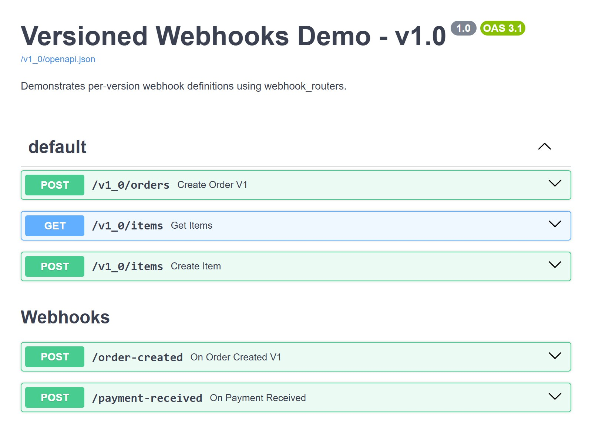
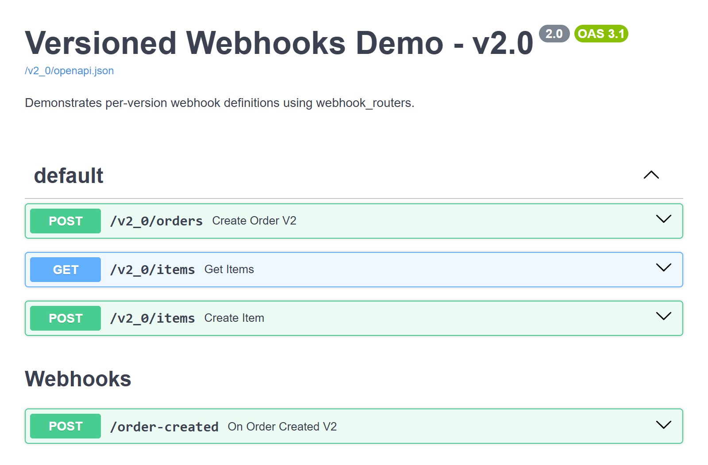

# OpenAPI callbacks and webhooks

Route-level **Callbacks** need no special handling: a `callbacks=[...]` argument on a route
is carried over to every versioned copy of it automatically:

```python
--8<-- "docs_src/advanced/callbacks.py:snippet"
```

**Webhooks** (`app.webhooks`) are visible in every version's schema by default. Pass
`webhook_routers` to version them the same way as regular routes, with `@api_version` on
each definition:

```python
--8<-- "docs_src/advanced/webhooks.py:snippet"
```

In [`webhook_versioning_app.py`](https://github.com/mat81black/fastapi-router-versioning/blob/main/examples/webhook_versioning_app.py), which follows this pattern, v1.0 lists two webhooks and v2.0 only `order-created`, with its v2 definition (the example's second webhook is `payment-received` rather than `payment-failed`):

=== "v1.0"

    { loading=lazy }

=== "v2.0"

    { loading=lazy }

A webhook version only becomes visible once a route version reaches that same prefix, since
both follow the same `remove_in` lifecycle.
