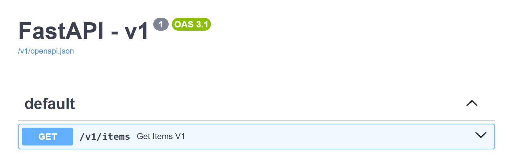
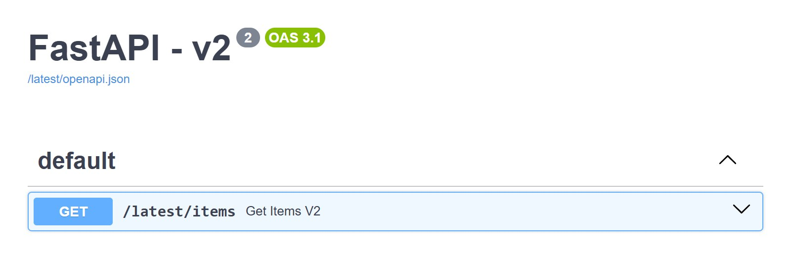

# Custom URL format

`prefix_format` and `semantic_version_format` control how a version renders in URLs and in
doc titles, independently of how it's expressed in `@api_version`. A common use is dropping
the minor number from the URL while still tracking it internally:

```python
--8<-- "docs_src/advanced/custom_url_format.py:snippet"
```

The routes are mounted under `/v1`, `/v2` and `/latest`, and the Swagger titles read `v1` and `v2` instead of `v1.0` and `v2.0`. Here are the docs at `/v1/docs` and at `/latest/docs`, which serves the newest version:

=== "/v1/docs"

    { loading=lazy }

=== "/latest/docs"

    { loading=lazy }

Routes are still decorated with `(major, minor)` tuples; only their URL and label change.
