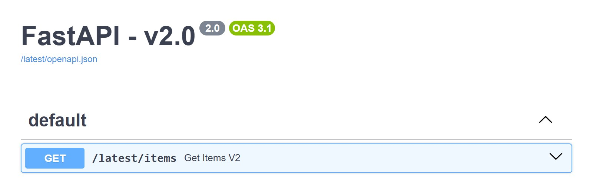

# Latest alias

```python
--8<-- "docs_src/advanced/latest_alias.py:snippet"
```

`/latest/...` now points at whichever version is currently highest. In the quick start app that is v2.0, and its docs at `/latest/docs` list the routes under the `/latest` prefix:

{ loading=lazy }

`/latest` gets its own docs pages like any other version, but it isn't listed in
`GET /versions` or the dashboard: those list versions, and `/latest` is a pointer to
one of them.
