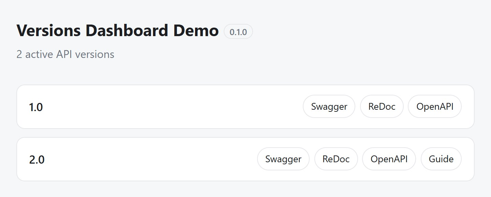

# Version discovery

```python
--8<-- "docs_src/advanced/version_discovery.py:snippet"
```

```json
GET /versions
{
  "versions": [
    {
      "version": "1.0",
      "openapi_url": "/v1_0/openapi.json",
      "swagger_url": "/v1_0/docs",
      "redoc_url": "/v1_0/redoc"
    }
  ]
}
```

Pass `versions_route_path="/api-versions"` (any path starting with `/`) to mount the endpoint
somewhere other than `/versions`.

A version whose `VersionInfo` sets `guide` also carries a `"guide_url"` in its entry, sent as
given (an external URL, with no `root_path` prefix).

If several `RouterVersioner` instances share one app and all set `include_versions_route=True`,
`/versions` is mounted once and lists every instance's versions together, instead of the
first instance shadowing the rest (see [Multiple routers](multiple-routers.md)). That single
endpoint is mounted by the first of those instances, which also fixes its path: a different
`versions_route_path` passed by a later instance has no effect.

Set `include_versions_dashboard=True` for an HTML counterpart: a page (at `/dashboard` by
default, moved with `versions_dashboard_path`) headed by the app's `title` and `version` and
listing the same versions with links to each one's Swagger, ReDoc, `openapi.json`, and its
`guide` when `version_info` gives one. It aggregates across instances and follows the same
first-instance-wins rule, works whether or not `include_versions_route` is also on, and is
kept out of the OpenAPI schema. The built-in page is plain; pass
`versions_dashboard_hook(version_models, root_path) -> str` to render your own instead (it
isn't handed the app metadata, so read `app.title` / `app.version` off your own app reference
if you want them).



The built-in dashboard, from [`versions_dashboard_app.py`](https://github.com/mat81black/fastapi-router-versioning/blob/main/examples/versions_dashboard_app.py).
