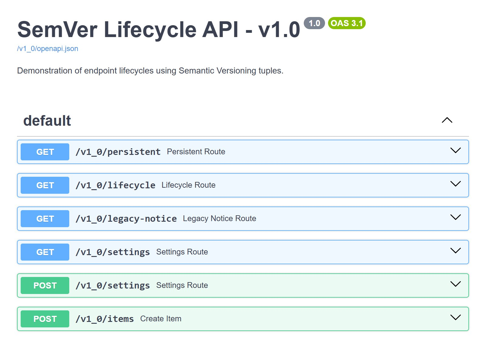
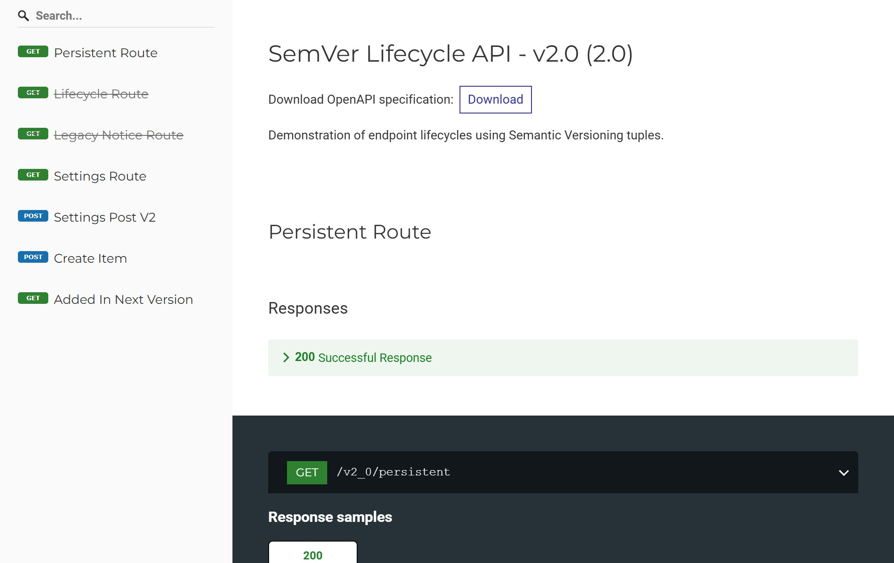

<div class="hero-logo" markdown>
{ width=128 }
</div>

# FastAPI Router Versioning { .hero }

<p class="hero-tagline">Router-based API versioning for FastAPI, with per-version docs and a declarative route lifecycle.</p>

Running multiple API versions side by side usually means duplicating routers, hand-rolling prefixes, or branching on request paths. `RouterVersioner` does it declaratively instead: annotate each route with the version it belongs to, and it generates the URL prefixes, the per-version OpenAPI schema, and the docs, without moving anything else in your app.

```python
--8<-- "docs_src/quickstart/semver.py"
```

## What you get

Every version gets its own Swagger UI, ReDoc and `openapi.json`, listing only the routes active in that version. These screenshots come from [`semver_app.py`](https://github.com/mat81black/fastapi-router-versioning/blob/main/examples/semver_app.py), where `/lifecycle` and `/legacy-notice` are deprecated in v2.0, `/newcomer` is added in v2.0, and a dedicated route takes over `POST /settings`.

=== "Swagger UI, v1.0"

    { loading=lazy }

=== "Swagger UI, v2.0"

    { loading=lazy }

=== "ReDoc, v2.0"

    { loading=lazy }

## Features

- **SemVer and CalVer**: version routes with `(major, minor)` tuples, or with arbitrary sortable strings
- **Per-version docs**: isolated Swagger UI, ReDoc, and `openapi.json` for every active version
- **Declarative lifecycle**: mark a route's introduction, deprecation, and removal with one decorator
- **Deprecation headers**: opt-in `Deprecation`, `Sunset` and `Link` response headers on routes in their deprecation window
- **Latest alias**: expose the newest version under a fixed `/latest` prefix clients can pin to
- **Self-hosted docs assets**: point Swagger UI and ReDoc at your own JS/CSS for air-gapped deployments
- **Reverse proxy and sub-app aware**: doc URLs pick up the ASGI `root_path` at request time
- **Route composition support**: works across nested routers, WebSockets, `Depends`, and OpenAPI Callbacks

## Requirements

- Python ≥ 3.10
- FastAPI ≥ 0.120.0, except `0.137.0` and `0.137.1`

!!! note "Why two FastAPI versions are excluded"

    `0.137.0` and `0.137.1` shipped a routing internals rewrite before `iter_route_contexts()` landed in `0.137.2`, which this package relies on. Supporting that narrow gap would have meant a third compatibility code path instead of the two the package actually needs.

## Installation

=== "pip"

    ```bash
    pip install fastapi-router-versioning
    ```

=== "uv"

    ```bash
    uv add fastapi-router-versioning
    ```
