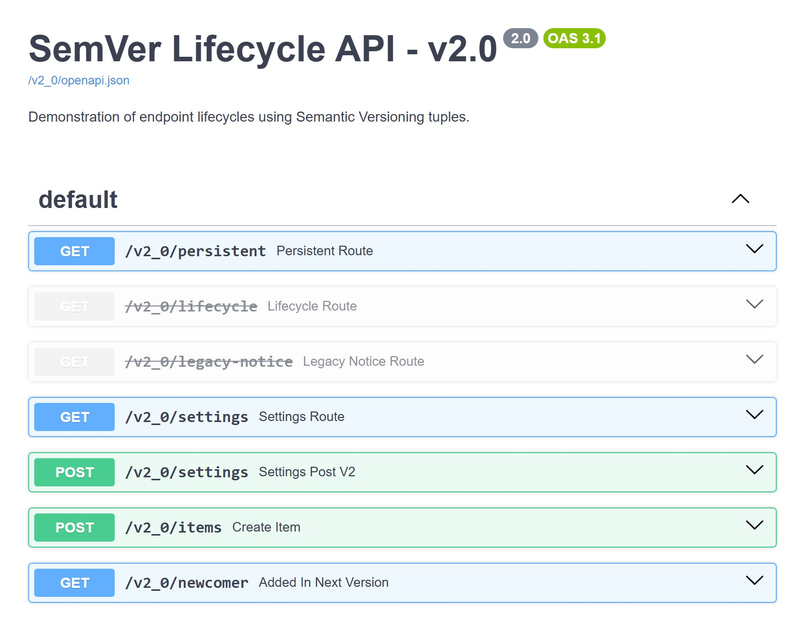

# Route lifecycle

`deprecate_in` and `remove_in` describe when a route changes status, without needing a
separate route definition per version:

```python
--8<-- "docs_src/lifecycle/legacy_route.py:snippet"
```

| Version | `/legacy` present? | Marked deprecated? |
|---------|-------------------|--------------------|
| v1.0    | yes               | no                 |
| v2.0    | yes               | **yes**            |
| v3.0    | no                | n/a                |

## Deprecation without removal

`remove_in` is optional: `deprecate_in` alone marks a route deprecated from that version
onward with no planned removal, staying available (and deprecated) in every later version.

## Routes without `@api_version`

A route without `@api_version` isn't excluded; it falls back to `default_version`
(`(1, 0)` for SemVer, `"1"` for CalVer, unless overridden).

## FastAPI's own `deprecated` flag

FastAPI's own `deprecated=True` (set directly on a route, or inherited from
`APIRouter(deprecated=True)`) is preserved as-is: `RouterVersioner` copies it into every
version unconditionally, on top of whatever `deprecate_in` computes. `deprecate_in` only
ever turns deprecation *on* for versions at or after its boundary; it never turns off a
`deprecated=True` that was already set natively.

!!! warning "Use one or the other"

    If you set both on the same route, it shows as deprecated in every version, including ones before `deprecate_in`'s boundary. Use `deprecated=True` for an unconditional, version-independent flag, and `deprecate_in` for a per-version lifecycle.

## One method of a multi-method route

A route with `methods=["GET", "POST"]` can have just one of its methods taken over by a
dedicated route in a later version; the other method keeps being served by the original
route. See [`semver_app.py`](https://github.com/mat81black/fastapi-router-versioning/blob/main/examples/semver_app.py)
for a working example.

## In the generated docs

In each version's Swagger UI and ReDoc, a route in its deprecation window is struck through, a route
removed from a version is absent, and a route introduced later appears only from that version. This is
v2.0 of [`semver_app.py`](https://github.com/mat81black/fastapi-router-versioning/blob/main/examples/semver_app.py):
`/lifecycle` and `/legacy-notice` are deprecated from v2.0, and `/newcomer` is introduced in it.

{ loading=lazy }

## Deprecation headers

Routes in their deprecation window can also emit `Deprecation`, `Sunset` and `Link` response
headers to clients; see [Deprecation headers](advanced/deprecation-headers.md).
