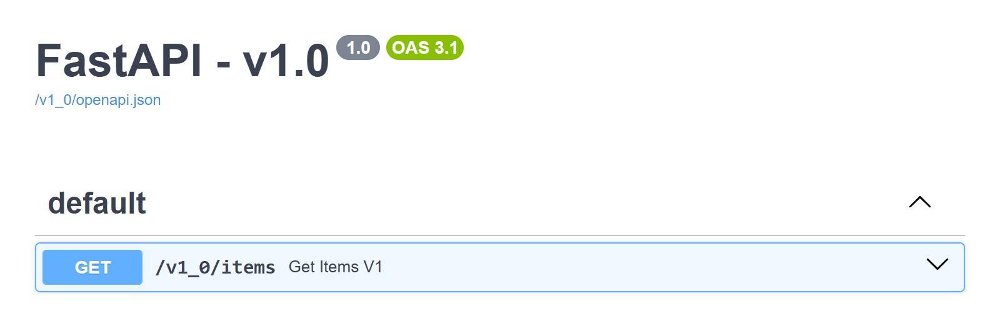
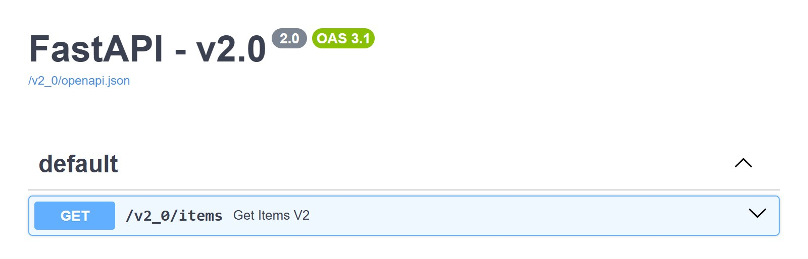
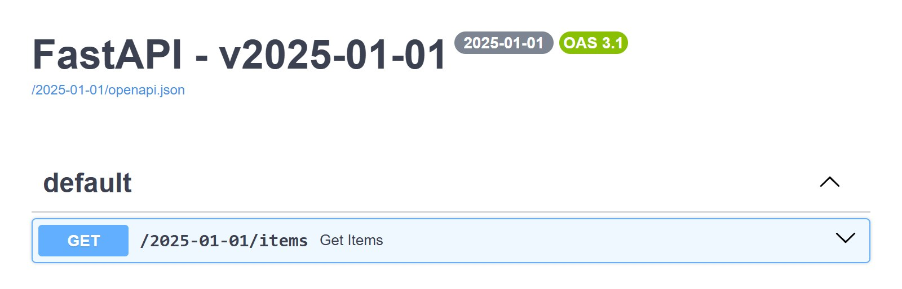

# Quick start

`RouterVersioner` is not a request-time dependency; there's no `Depends()` involved. It's a
one-time setup step: you build it, then call `.versionize()` once, and it reads the routers
you gave it and mounts one copy per version. Attach `@api_version` to every route **before**
calling `.versionize()`, since that call is what reads the router and wires everything up;
routes added to the router afterward are never picked up.

## SemVer

```python
--8<-- "docs_src/quickstart/semver.py"
```

The routes are mounted under `/v1_0/items` and `/v2_0/items`, and each version has its own docs, at `/v1_0/docs` and `/v2_0/docs`, listing only the routes of that version:

=== "v1.0"

    { loading=lazy }

=== "v2.0"

    { loading=lazy }

## CalVer

```python
--8<-- "docs_src/quickstart/calver.py"
```

The route is mounted under `/2025-01-01/items`, with its docs at `/2025-01-01/docs`:

{ loading=lazy }

CalVer tokens can be any string ("2025-01-01", "v3", "stable"...), but they are sorted
lexicographically to determine version order.

!!! warning "CalVer ordering"

    ISO dates and zero-padded numbers (`"v01"`, `"v02"`) sort correctly; unpadded strings like `"v1"`, `"v10"`, `"v2"` do not, and will place routes under the wrong version.
